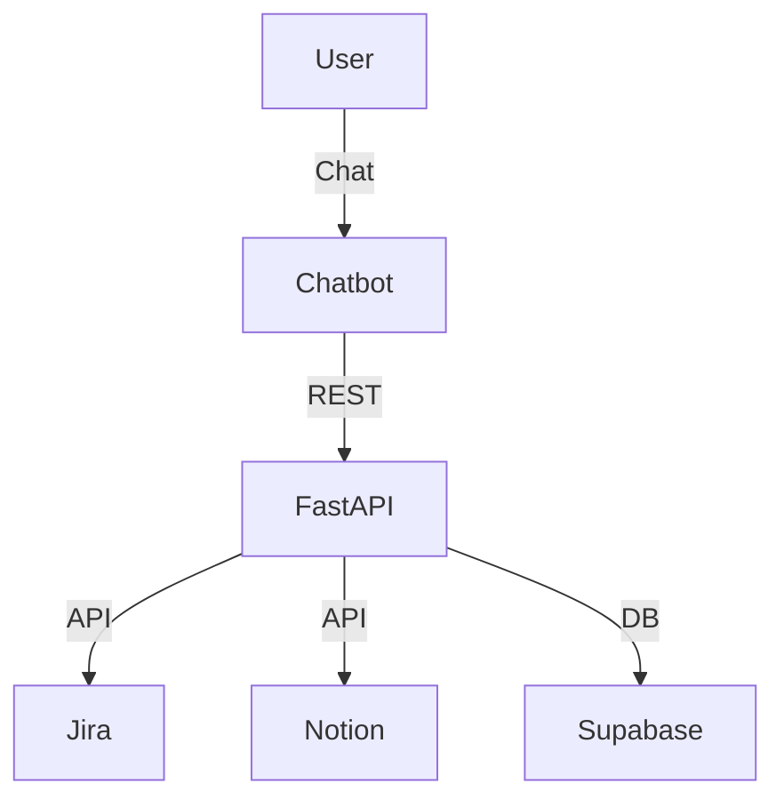

---
hide:
    - toc
---

# Chapter 21: Integration with Enterprise Systems

> “A chatbot is only as useful as the systems it can talk to.”

## Introduction

At its core, a chatbot is a bridge between human intent and machine capability. But without access to your company’s systems—your CRM, your workflows, your databases—it’s just a fancy interface with nowhere to go.

Enterprise integration is where your chatbot evolves from a helpful assistant into a mission-critical teammate. Imagine a sales bot that updates Salesforce in real-time. Or a support agent that triggers an internal Jira ticket. Or an HR assistant that syncs leave requests into Workday.

This chapter explores how to integrate your chatbot with the ecosystem of enterprise tools that run your business. We’ll cover technical approaches, middleware strategies, security concerns, and real-world examples—ensuring your chatbot doesn’t just talk, but acts.

**Pro Tip:**
Start with the simplest integration (webhook or API) and evolve to more robust middleware or event-driven architectures as requirements grow.

---

## 21.1 Why Enterprise Integration Matters

### 1. **Operational Efficiency**

* Automate repetitive internal tasks (e.g., data entry, reporting, status checks).
* Reduce human handoffs for routine workflows.

### 2. **Contextual Intelligence**

* Pull user-specific data (e.g., past orders, account status) to personalize conversations.

### 3. **Bi-directional Sync**

* Let users update records (e.g., change delivery address, update email) directly via chat.

### 4. **System of Action**

* A chatbot should not only *inform* but also *trigger actions*—from submitting forms to executing backend jobs.

---

## 21.2 Levels of Integration: From Simple to Sophisticated

| Integration Type                     | Example                                                 | Tools/Tech                       |
| ------------------------------------ | ------------------------------------------------------- | -------------------------------- |
| **Webhook-based**                    | Chatbot triggers Zapier webhook                         | Zapier, Make, n8n                |
| **API-based (REST/GraphQL)**         | Chatbot fetches data from HubSpot or Salesforce         | Axios, Requests, GraphQL Clients |
| **Database-level**                   | Querying company PostgreSQL directly for lookup tasks   | SQLAlchemy, Prisma, Supabase SDK |
| **Platform SDKs**                    | Using Slack SDK to trigger workflows via slash commands | Slack Bolt, MS Bot Framework SDK |
| **RPA (Robotic Process Automation)** | Triggering UI-level automation in legacy tools          | UiPath, Power Automate           |

**Integration Decision Table:**
| Criteria         | Webhook | API | DB | SDK | RPA |
|------------------|---------|-----|----|-----|-----|
| Speed            | High    | Med | Med| Med | Low |
| Flexibility      | Low     | High| Med| High| Med |
| Security         | Med     | High| Low| High| Low |
| Maintenance      | Low     | Med | High| Med| High|

---

## 21.3 CRM Integration (Salesforce, HubSpot)

### 21.3.1 Salesforce Integration

* **Authentication**: Use OAuth 2.0 or token-based access.
* **API Interaction**: Salesforce provides REST APIs (and older SOAP APIs).
* **Use Cases**:

  * Create or update leads directly from conversation.
  * Fetch deal pipeline data for sales summaries.
  * Auto-log user interactions as activities.

### Sample Code Snippet (Python)

```python
import requests

def get_leads(access_token, instance_url):
    headers = {"Authorization": f"Bearer {access_token}"}
    response = requests.get(f"{instance_url}/services/data/v54.0/query",
                            headers=headers,
                            params={"q": "SELECT Id, Name FROM Lead LIMIT 5"})
    return response.json()
```

**Best Practice:**
- Store API credentials in environment variables or secret managers.
- Implement retry logic and error handling for all external API calls.

### 21.3.2 HubSpot Integration

* **Authentication**: OAuth or API Key (deprecated).
* **Use Cases**:

  * Capture leads from chatbot conversations.
  * Update contact properties based on intent.
  * Trigger workflows via HubSpot’s workflow API.

**Tip:**
Use HubSpot’s webhook subscriptions to receive real-time updates and trigger bot actions.

---

## 21.4 Workflow Automation (Zapier, Make, IFTTT)

Sometimes you don’t need full-blown custom code. Low-code platforms let you trigger workflows without managing infrastructure.

### 21.4.1 Zapier

* Create “Zaps” that trigger from chatbot webhooks.
* Example: User asks for a demo → Zapier logs it in Google Sheets + sends Slack notification.

```json
// Sample webhook payload to Zapier
{
  "name": "John Doe",
  "email": "john@example.com",
  "interest": "Product Demo"
}
```

**Security Note:**
Validate all incoming webhook payloads and use secret tokens to prevent spoofing.

### 21.4.2 Make (formerly Integromat)

* Visual flow editor for complex workflows.
* Supports conditional branches and data manipulation.

### 21.4.3 IFTTT

* Simpler automation: “If chatbot says X, then do Y.”
* Better for consumer-focused bots (e.g., smart home, social updates).

---

## 21.5 Enterprise Chatbot Platforms (Dialogflow, Rasa, Microsoft Bot Framework)

Your chatbot might already live in an enterprise-grade platform. Here’s how integration plays out there:

### 21.5.1 Dialogflow

* Native integrations with Firebase, Slack, Messenger.
* Use **fulfillment** to call external APIs during a conversation.
* Example: Call an order-tracking API when user provides an order number.

### 21.5.2 Rasa

* Fully open-source and highly customizable.
* Use **custom actions** for backend calls and database operations.
* Requires building and managing your own action server.

**Example: Rasa Custom Action (Python)**
```python
from rasa_sdk import Action, Tracker
from rasa_sdk.executor import CollectingDispatcher

class ActionFetchOrder(Action):
  def name(self):
    return "action_fetch_order"

  def run(self, dispatcher, tracker, domain):
    order_id = tracker.get_slot("order_id")
    # Fetch order from DB or API
    dispatcher.utter_message(f"Order {order_id} is being processed.")
    return []
```

### 21.5.3 Microsoft Bot Framework

* Deep Azure integration: Cosmos DB, Logic Apps, Power Automate.
* Rich enterprise-ready tooling and multi-channel deployment.

---

## 21.6 Integration Architecture Patterns

How should your chatbot talk to enterprise systems?

### 1. **Direct API Integration**

* Use backend logic to make direct HTTP calls.
* Pros: Fast, simple.
* Cons: Tight coupling. Rate limits and auth must be handled manually.

### 2. **Middleware/Service Layer**

* Backend routes chatbot requests through a middleware (e.g., FastAPI, Express) that manages logic.
* Centralizes API tokens, error handling, and logging.

### 3. **Event Queue + Workers**

* Publish intent to a queue (e.g., RabbitMQ, Kafka).
* Let background workers process the job asynchronously.
* Ideal for longer processes (e.g., ticket generation, file uploads).

**Pattern Example:**
```python
# FastAPI endpoint publishes to RabbitMQ
import pika

def publish_to_queue(payload):
  connection = pika.BlockingConnection(pika.ConnectionParameters('localhost'))
  channel = connection.channel()
  channel.queue_declare(queue='jobs')
  channel.basic_publish(exchange='', routing_key='jobs', body=json.dumps(payload))
  connection.close()
```

---

## 21.7 Security and Compliance Considerations

Enterprise integration means handling sensitive data. Don’t cut corners.

* **Authentication**: Use OAuth, signed JWTs, or token rotation systems.
* **Authorization**: Ensure bots can only access data the user is entitled to.
* **Data Handling**:

  * Encrypt data in transit and at rest.
  * Anonymize where possible.
* **Audit Logging**: Track all API interactions for compliance.

* **Rate Limiting**: Prevent abuse of integration endpoints.
* **Input Validation**: Sanitize all data before passing to enterprise APIs.

---

## 21.8 Real-World Example: Support Chatbot + Jira + Notion

**Use Case**: A support chatbot triages issues, then logs them to Jira and documents solutions in Notion.

1. User describes a bug.
2. Bot extracts keywords and severity.
3. Sends structured ticket to Jira using REST API.
4. Logs the resolved issue summary in Notion for knowledge base building.

**Technologies**: FastAPI backend, Jira Python SDK, Notion SDK, Supabase for user session data.

**Architecture Diagram:**



---

## 21.9 Monitoring and Reliability

* **Retry Logic**: Always handle API call failures with exponential backoff.
* **Circuit Breakers**: Prevent downstream system overload.
* **Monitoring Tools**: Use Sentry, Prometheus, or Datadog to watch integration endpoints.

* **Alerting**: Set up alerts for failed integrations or high-latency calls.
* **Dashboards**: Visualize integration health and throughput for ops teams.

---

## Conclusion

Your chatbot’s intelligence comes from its brain—but its usefulness comes from its arms. By integrating with CRMs, databases, and workflows, you give your bot the power to *do*, not just *talk*.

**Enterprise Integration Checklist:**
- [ ] API credentials and secrets managed securely
- [ ] Retry and circuit breaker logic implemented
- [ ] All integrations monitored and logged
- [ ] Rate limiting and input validation in place
- [ ] Compliance and audit logging enabled

In the next chapter, we’ll level up further by expanding your chatbot’s capabilities into **voice, image, and document** processing—creating a truly **multi-modal** assistant ready for the next era of human-computer interaction.

---